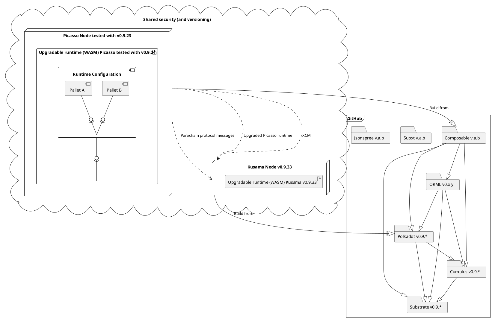

# Runtime Upgrades and Versioning

This diagram shows our compile time and runtime dependencies to guide the upgrade process.

We have to follow Substrate/Cumulus/Polkadot version and relevant ORML closely.

Runtime WASM version of Picasso is bumped automatically. Compile time version of Composable to be defined in release process document.

## Guidances

Check if any chain updated to version you want to update. Until you blocked by lack of features on current version, consider no upgrade.
Suggest chain to check is Acala if you depend on ORML.

Check versions:
- Substrate
- Polkadot
- Cumulus
- ORML

And if using Rust remote clients
- Subxt
- Jsonspree 

In case of dependency on Smolldot, check its version too.

All should be updated to same version at best. Or as close as possible.

Do not update your chain directly. Put patch your forks of all dependencies with relevant commit and branch.
Because anyway at some point you will have to do backport, hotfix or patch.

On update, use commit hash instead of branch name as more determinism dependency. 
One may break branch by commits into, but not commit. 

