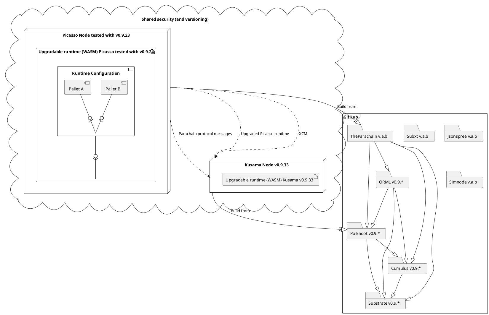

# Runtime Upgrades and Versioning

This diagram shows our compile time and runtime dependencies to guide the upgrade process.

We have to follow Substrate/Cumulus/Polkadot version and relevant ORML closely.

Runtime WASM version of Picasso is bumped automatically. Compile time version of TheParachain to be defined in release process document.


## Guidances

Check if any chain updated to version you want to update. Until you blocked by lack of features on current version, consider no upgrade.
Suggest chain to check is Acala if you depend on ORML.

Check versions:
- Substrate
- Polkadot
- Cumulus
- ORML
- Centauri (uses ORML and Simnode)
 

And if using Rust remote clients
- Subxt
- Jsonspree 

And if using for testing:
- `sc-simnode`(polytope-labs).
- - xcm-simulator (ACala)

In case of dependency on Smolldot, check its version too.

All should be updated to same version at best. Or as close as possible.

Do not update your chain directly. Put patch your forks of all dependencies with relevant commit and branch.
Because anyway at some point you will have to do backport, hotfix or patch.

On update, use commit hash instead of branch name as more determinism dependency. 
One may break branch by commits into, but not commit. 





# Overview

Upgrading runtime of parachain connected to relay via democracy.

Most operations can be done via `polkadot.js` `Governance` tab for `Council` and  `Democracy` which is well documented by Parity. 

Here we do outline directly pallets extrinsics calls.

### General flow

1. Send to chain desire to update.
2. Make that desire be voted
3. Vote
4. Enact

#### Preparing preimage

```scale
preimage_hash = parachainSystem.authorizeUpgrade(BlakeTwo256(wasm))
democracy_proposal_hash = democracy.notePreimage(set_code_preimage)
```

Store all values out of process and share `wasm` reference, ***preimage_hash*** and encoded extrinsics with relevant channels.

#### Council collective (optional)

***council (main) member*** do next on chain:

```scale
# motion to propose default YES vote on democracy to apply new runtime code
proposal_hash = council.propose(democracy.externalProposeDefault(democracy_proposal_hash))
```

others if any needed do:

```scale
council.vote(proposal_hash)
```

and after to enact it to start voting:

```scale
council.close(proposal_hash)
```

#### Technical collective (optional)

```scale
referendum = democracy.fastTrack(proposal_hash, ..)
```

### PICA holders

```scale
democracy.vote(referendum)
```

### Technical (Optional)

Actually it is done by scheduler, but technical can try enact it earlier

```scale
democracy.enactProposal
```

### Upload runtime

After proposal enacted,

`parachainSystem.enactAuthorizedUpgrade` can be called by anybody with wasm file. 

If runtime upgrade is big(count on migrations), run it via `scheduler`. 


## References

- https://substrate-developer-hub.github.io/substrate-how-to-guides/docs/parachains/b-runtime-upgrades/runtime-upgrades/
- https://substrate.stackexchange.com/questions/1061/what-is-the-proper-way-of-executing-a-runtime-upgrade-on-a-parachain
- https://karura.subsquare.io/democracy/referendum/37
- https://wiki.polkadot.network/docs/learn-runtime-upgrades
- https://github.com/paritytech/cumulus/issues/764