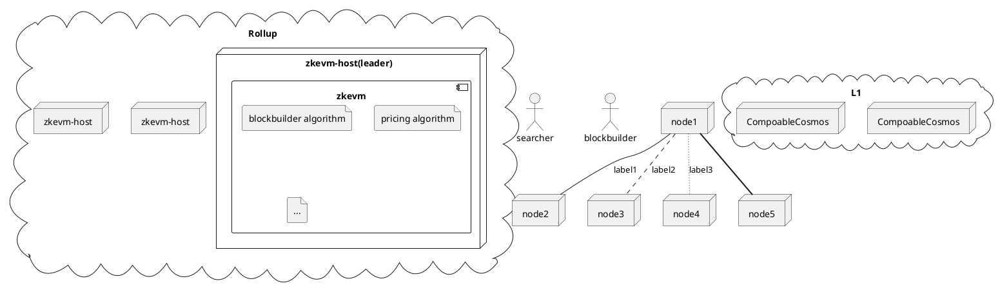

# CDA market and dependency research questions

To build CDA(Cross Domain Auctioner) need to clarify serveral points.

## Some variable to consider

- time to market
- competition
- volume of flow
- capturable by us volume of flow 

## Atomicity

Will pre conirmation from blockbuilders be accepted by blockbuilders as solution?

What are exact formulas give to calculate amount to bribe builders so that block likely be pre confirmed? 

Why other solution will are not picked?

## Chains to handle first

What 2 chains we want to build blocks for? 

Why exactly these 2?

Do they have blockbuilders?

Do they have direct bridge connection?

Why CDA release on these chains will bring real traffic(amount settled) and what will be size?

## Do searchers really need abstraction?

Idea is to abstract execution and data via CVM (unified asset id and possible venues operations, like exchange and stake).

Is it relly needed? Is that a problem to searchers who do CEX/DEXs now? Or do Wormhole/Axelar arbitrage?

With product which seeks directly on each chain and sends to blockbuilder of each chain, they may no need to CVM in general, except simple bridge of tokens from chain to chain directly.

#  Is MANTIS CDA stateless? So it never has its own state persisted onto disk in its own data.  Tthe only data it perists happens on L1s? 

# MANTIS CDA  Technical

# Overivew

Assumes you know MANTIS CDA operates logically as per previous document with centralized server.

Document starts from simple human description, and follows up with diagram tyring to say same thing in more formal way.

## Human

*Design desribes single L1 Rollup, while Rollup which interacts with severa L1 is alternative**

Searchers and blockbuilders deposit assets to L1 Vault of Rollup.

Rollup follows deposits on L1 Vault.
t

## Formal

## Composable test tasks for Blockchain Engineer

# Solutions acceptance

Consider solving problems using Rust/Go/TypeScript/Python/Nix/Bash or Solidity.
 
Solutions must have tests showing they work.

Solve any one of these. Feel free to solve all.

Share problems as archive or private git repository.

## Order matching (hint Coincidence of Wants)

You have a $list \ of \ orders$.

Each orders expresses amount $X$ of input token $A$, and minimum desired $Y$ amount output of token $B$.
Getting more than expected amount of $Y$ is okey, trying to "spend" from order more than $X$ is not okey.
$X$ and $Y$ are $limits$ of order.

Orders will want to exchange $A$ to $B$ or $B$ to $A$.

Let $X_ab$ and $Y_ab" be amounts in order $A$, and $Y_{ba}$ and $X_{ba}$ in order $B$.

When $X_{ab}$ = $X_{ba}$ and $Y_{ab} = Y_{ba}$,
orders perfectly matched and can be $filled$.

If $X_a/Y_a = X_b / Y_b$, but $X_a \ne X_b$ or $Y_a \ne Y_b$, orders can be perfectly matched, but on of them will be $partially \ filled$.

If $X_a/Y_a \ne X_b / Y_b$, order still can be matched, iff matching does not violate $limits$.

Volume $V_o$ of $order$ is $V_o = X * Y$.

Volume $V_m$ of $match$ in case of 2 orders is $V_m = (X_{ab} + X_{ba}) * (Y_{ba}+Y_{ab})$.

$Match$ with higher $V_m$ is $optimal$.

$P_o = X/Y$ is $optimal \ price$ if it produces $max(V_m)$

**Problem**

Given $list of orders$ find $P_o$, price which fills maximals volume.

Write verifiers, which checks that $solution$ does not violates orders $limits$ and all orders are filled agains same $P_o$.

All amounts to be expressed in integer values.

*Hint: Consider finding range of prices from order data, and iteratively solve against each price.*

**Bonus(Optional)**

Solve it when $X_{ab}$ is maximum amount order gives, but $Y_{ab}$ is maximum amount.

In this case $order$ "prefers" spend less to get not more than.
 
**Bonus(Optional)**

When $P_o$ found, try to ensure that solution prefers filling more orders with equal proportion rather,
than filling some orders fully, while partial orders get way less.

**Bonus(Optional)**

Order can accept partial fill or not. Solve for $V_o$, but ensuring filling intention is satisfied.

**Bonus(Optional)**

Consider range of limits to be big. 
Find a fast way to find biggest volume, it is okey to be practically optimal, but no absolutly.

## Container with plants (hint MANTIS)

Madeira hosts botanists growing exotic plants.  They want to send some of the plants to New York to sell.  However, they have only a single container available with total volume $V$.

On top of limited space, some plants produce natural chemicals which will make other plants die.  Such plants cannot be in same container.

$I$ is set of plants genuses which could be possibly grown on Madeira.
$V_i$ is volume specific plant takes. 

$P_{b,i}$ equals to number of specic plant one botanist wants to send.

$I_{i,j}$ is table of plants, if there is entry in this table, plant cannot be sent along with other.

*Hint: consider it as symmetric matrix with rows and colums, so if there is entry for a pair of plants, they cannot travel together*

Each $B$ wants all of hist plants to be shipped or none.

**Example**

$B_1$ wants to ship plant $V_1$, $V_3$, $V_7$, $V_7$.

$B_2$ wants to ship plant $V_2$, $V_3$, $V_{14}$.

$I_{1,2}$ is true 
and 
$V_{empty} > V_1 + V_3 + V_7 + V_7 > V_2 + V_3 + V_{14}$,

All plantss of $B_1$ will be shipped, and none of $B_2$.

**Task**

Maximize $V_o$ volume of plants botanists can send in single container from all bags available and no single plant died.

*Hint: knapsack*

## Routing across Cosmos stations (hint CVM)

The Universe is filled in with stations $S$.  Some of them are connected by portals $P$ which allow a traveler to hop between them. Specifically, if there is a portal $P_{i->j}$, the traveler can jump from station $S_i$ to station $S_j$.  Note that portals are one-directional; existence of $P_{i->j}$ *does not* imply existence of $P_{j->i}$.

Galactic commandment tasks you to traverse route $T$, defined as directed graph $T_{start} = S_i, \space optional \space T_a, \space optional \space T_b$.  So each hop on route tells to visit some station, and potentially split into one or two new routes. There is always some hop $P_{i,i+1} \in P$ from stations to stations if route tells that. Some station may be visited several times.

On some stations you given instructions to execute operation $O_a$.
${O_a}$ instruction tells talk to habitants of station.

Unfortunately, commandment is not aware of whole situation and has some bad data about stations capabilites and propeties $A$ it used to judge requested routes execution possible. 

$A_a$ means $S_i$ has habitants.  Some station got habitants vanish for unknown reasons, so $O_a$ cannot be executed. If $O_a$ requested, it cannot be executed, $T$ is impossible.

$A_b$ means $S_i$ can be used to launch drones. Launching drones is only way to traverse $T_a$, $T_b$ route split. One route is traversed by mainship and other by drone. Drone is AI one, so it can do $O$. 

$A_c$ breaks you engines on launch, so after such station one can hop only one final time.

$A_d$ stations to allow hop from $S_i$ to ${S_{i+2}}$ station without visiting $S_{i+1}$. Can hop over ${A_c}$ sure, unless you require some $O$ there.

$A_e$ station break mainship drone launching capabilities, so you may not be able to launch drones on any stations in route again.

Drones traversing path can do all $0$ and use all $A$, except $A_e$ and $A_b$. 

**Solution**

Given $T$, $P$ and $S$ and properties of each station $A$ and $O$ to execute, verify that route is traversable.

$T$ is a tree with root starting on one $S_{start}$ and possibly branching along the way.

_**So commandment wants to see how $T$ will be traversed with all $O$ executed and what $A$ used, or reason of failure if not possible to traverse route with all $O$ executed. Commandments expect you to try any subset of $A$ on each $S$ to finish mission. **_.

Report all station properties used along the way.

*Hint: try traverse without $A$ and add one by one, during travers propagate whole previous path down*

**Bonus(Optional)**

Estimate average and bad cases for memory and time usage.

**Bonus(Optional)**

There are fancy research stations, allowing to use some fancy devices:

- $A_f$ station allows to reuse properties of previous station on next. So if ${S_i}$ has ${A_f}$ property, than on ${S_{i+1}}$ you can use any of properties of ${S_{i-1}}$, unless it is $A_f$ and $A_h$.
- $A_h$ is same as $A_f$ except that if decision to use properties of previous station taken, none of properties of target station can be used. $A_f$ and $A_h$ are not portable.

**Bonus(Optional)**

Each $A$ has a PICA fee to be used. Return cheapest route only.

**Bonus(Optional)**

Sometimes not all properties are know ahead.

While you on station ${S_{i-1}}$, only jumping to ${S_i}$ will reveal properties of $S_{i+1}$.

Given limited information, find out what is best step to take next to get best progress.

## Other Composable problems

Company also solves linear convex/mixed integer programming, big prime numbers in polynomials(math tricks) and defi control/game theory and fancy O notations limits/bit tricks on compute to amuse wider range of candidates.