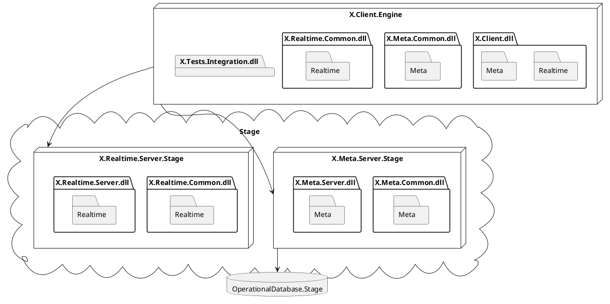
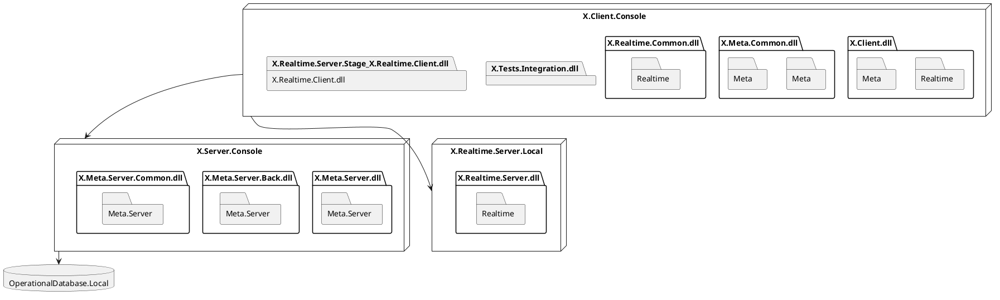
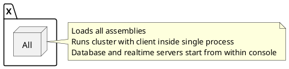
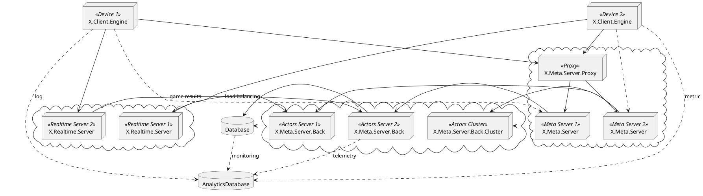
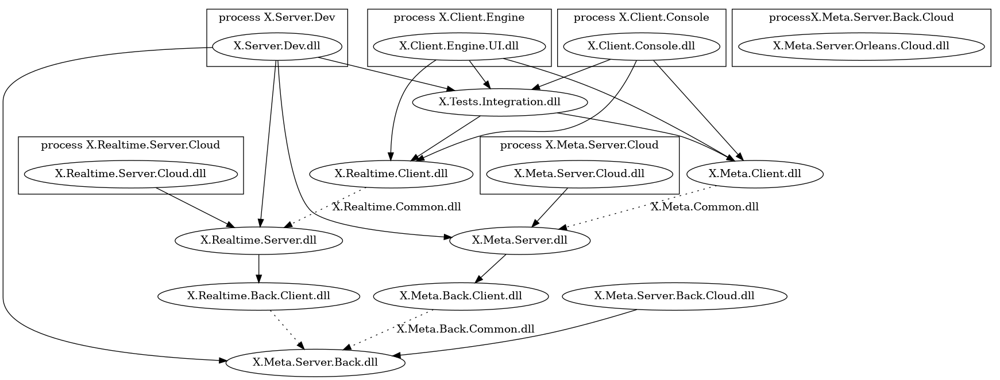
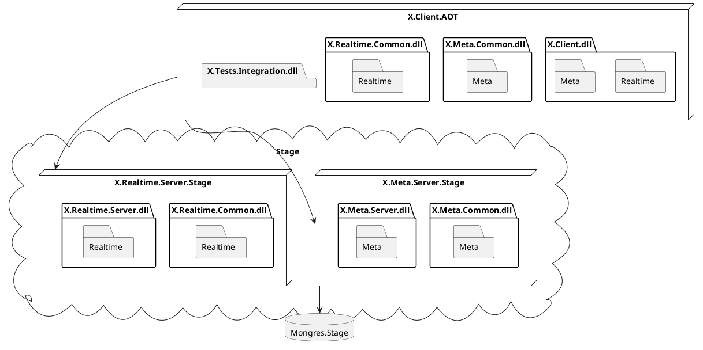
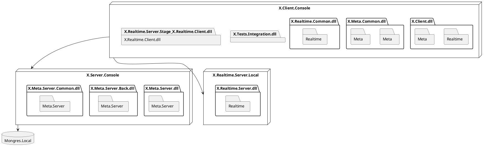
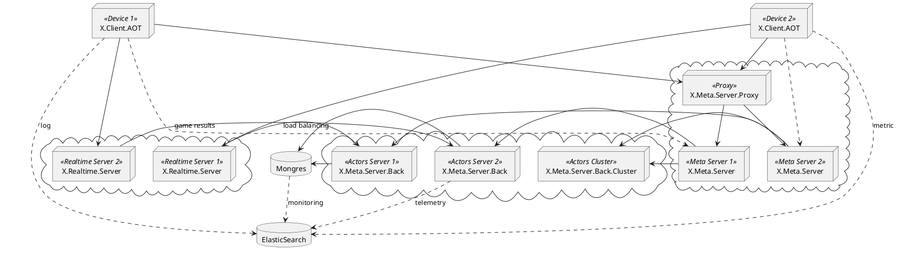
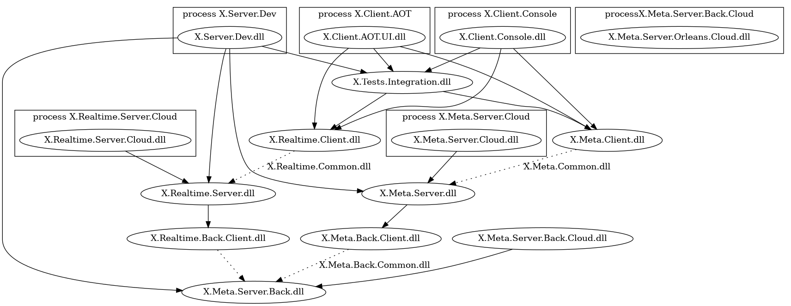

## Overview of architecture

DL: Simple diagram with several clients and metas and realtimes. No details.
DL: will nodes properties (meta and realtime )

Hint: Realtime edge server are very important for gameplay. Laggy games do not earn.

---

## Before game begins. Speculative execution

DL: Upgrade trooper with default money.
DL: Upgrade logic is requested to be done by server.
DL: Upgrade logic is done on client using shared logic
DL: Server runs same logic on it.
DL: No conflic - OK. Conflic - new state is send to client.

Here we see first hint of hack with time, and need for code reuse.
No visible delay must be beetwing user and his desrie to equip helmet for 10 USD.

---

# Before game begins. Match making

DL: client SIgnarR(WebSockets) into Meta.
DL: Queu with matchking alogirht works (different maps, games, for differnt players)
DL: Set of playr to play togter identified
DL: Whole game configueation is send to realtime and is sealed during match.

---

# Code reuse and namespaces

DL: Will show how to setup namespaces and assemblies to reuse code and how.
DL: will try to have just usual dot net project and generate dependencies
DL: stress test run
---

# Non stop servers. Meta

Sometimes we what to change mathaking and upgrade rules without redeploy.
Example: Level 100 needs 42 extra exepricnes.
Example: If level is more than 13, allow to play on new map.

How:
- Game config JSON is edited in grid view editor by game designer
- JSON is validated by JSON Shema (NSwagger) 
- Dropped into one of meta folders via secured file (SCP)
- Folder is monitore by ASP net file montoore
- JSON is read and validaed, stored in database
- New JSON is porpogated into all actors

Hint: there are may be subtle issues during upgrade, to avoid this all actors items pass config version alongside.

--- 

# Several words about deployment

- Fresh git clone runs as local host out of box Unity run and dotnet run.
- Deployed for testing onto single instnace
- Meta deloyed on centra storge, database in replica, realtiems onto edges
- May stop and start meta and realtiems separately
- Using `pwsh` and `ssh`
- Hardware no VM (5-10 times faster than cloud VMs for same price)

See 12 factor app. See deploument

---

# Realtime. Constraints.

- Player must perceive games as if it is running on his local device.
- Which includes immediate feedback on pressed shoot button.
- But allow to prevent cheating
- Player must
- Performance must be predictable and linear in time.

---

# Realtime. Architecture.

- There are several, very different.
- Exensivelu documented https://github.com/MFatihMAR/Awesome-Game-Networking

Hints: They way you do physics, what genre you are doing, how many live entities in game at once and how fast they change state and monteization stategy greatly - all these influcne options chosen.

---

# Realtime. Arhitecture. Our

- no physics simulation on server
- client does physics (no map, no collisions)
- sever and client maintain common world state
- world stated updated by commands from client
  
- Example: clip and shots count, damage (dependant on current player parameters) will realized as part of model
- Example: who was under attack will came from client (physical world location), but than game snapshots model will work

Hint: Cheating is possible, anticheaing either.  Improve step by step as game becames popular

---

# Realime. Netcode. Client shoots.

Frame 42. 3600 milliseconds since game started.

- *Input* Gamer presses shot
- *Graphics* Fire from gun and ammo decrement
- *Netcode* Client sends input into networks

Hint: Should we wait for delivery of command? Do we care if exactly that command reached the server?
Hint: Commands - shoot, use skill, move, ...

---

# Realtime. From server to client

Frame 42. 3700 milliseconds since game started.

-
DL: flow from server to client
DL: if new world state available, send it

---


# Round Trip time (rtt)
- ping
- Sender: Record time 1. Sequenc number 10.
- Server: Last aknowledege packet. Sequnce number 10. SEqver squences 5. Time since 10 was received was 30 (time processing of server).
- So RTT is cloent = time recvied - time processing - time send 
- measrue on every packet X

- other way of server to say the time it wants client to send its input?

---


# Realtimem. Netcode. TCP

TCP does guaranded delivery, so went message lost - we wait to deliver what is already usessle.
Custom protocl on UDP:
DL: issues with UDP.

---

# Size of data

10 playes eah 10 properies, 10 game object 5 properies, each player has 5 skills, each skill has 5 properites.

---

# MTU
- 1.4kb or 476b.
- could allow cust into 476b and do cross packet compression? so that imporatnt stuff in first packet. not imporatant in second.


---

# Realtime. Netcode. Message size.JSON

---


# Realtime. Netcode. Strings with known shema.

---

# Realtime. Know. Numbers compresion.


---

# Let loot at numbers.

Negative integers in computers start with 1. So negative value can be `1000 0001` or `1000 1111`. 
`ZigZag` converts that into something which does not starts from 1, e.g. `00000111`. 
Positive values are encoded either.
Eventually, these zeroes in start may be dropped during networks serialization.

https://gist.github.com/mfuerstenau/ba870a29e16536fdbaba

---

# Lossles. SevenBit

---

# Lossles. Fibonacci

---

# Floatrs and precision loss.

Half, quatenion. 

---

# Range

We now number is from 0 to 10000. It needs max 14 bits.
We now then number is from 0 to 100, with needed precisions 0.01. So need 14 bits.

Hint: If you see mistake in our slides, be sure these are correct in game - becasuse we TDD.

---

# Protocoal based.

- Sequence number (will be used for other puposes either)
- Client tels sever what he received to server

---

# Diff

1. Server send client number 10. 
2. We still have 10 on server. Send nothing this time.
3. Sever has 12 now. Send 12 to client.

--- 

# Diff with confirmation


0. We send client 10.
1. We

               Send bitmask of received tick baseliend on LAST_RECEIVED_SEQUENCE
                bit mask is must if doing delta -  server will resend delta until got into client
                if at least one delta will not get in buffer size cycle - disconnect (allow send robustly events)


No changes.

On Server A has value 123456. server knows that Client confirmed value of A to be 123456. Server sends one or couple of bits to state there is no change of that value.

Changed.

On Server A has value 123456. server knows that Client confirmed value of A to be 123456. Server sends value of 123456 with some bit(s) to state there is change.


---

# Delta

1. Client received Trooper position 7 at Server simulaiton framr 88.
2. Server got configramtion from client that he recieved at 91.
3. Trooper position is 10 at 91 server frame.
4. Server sends 3 to client basing on frame 88.

---

# Prediction

1. Trooper moved 7, 8, 9, 10 at frame 88, 89, 90, 91 at Server.
2. Client knows 7, 8, 9 moves and predicts 10.
3. Server knows that client will predict 10 as same formula used.
4. Server thends 0, i.t delta from predicion.

Hint: Prediction could be non linear, but complex, and ulimately learned from many games and used.
   
---


# Huffaman and fast huffman.


Affter diff and delta `00000000000111111000000011111110000` - can compress

Hint: may look into zstanda and agd to look for faster codeds
Hint: all this logic should take only part of rednerign frame 
Hint: could we learn prediciton?
Other pssobilieis.

---


# delay. interplocate locatio.

---

# delay. interpolafe velocity.

---

---


# how far we can shoot into the past?

 Minimazing delay

VS: Using variance to ensure client in the futur for RTT

---

# handle dissconnection. sliding windows.

---


# What if our speculation was wrong?

VS: Reconcilation

---

# Recall

No GC and all this logic.

Example: cannot jump if rooted.
Example: Cannot be hurt if immortal.
Example: Must became visible when uses grenade.

---

## Server vertical scale architecture.

Input = Sequencye buffer (MUST SHOW WHAT IS SEQUNCE BUFFER EARLIER)

Room = `System.Threading.Channell<GameCommand>`. Rooms = `List<System.Threading.Channell<GameCommand>>

Game Server= Rooms + `Task.Run` eaual to number of hardware threads minus - 1.

---

## Server horizontal scale code.


Hint: Vote for  to allow GC free channels!

---

# Industyc knowled.

ECS, funcional, not oop.

---

# ECS constrainst

DL: Why we need ECS?

---

# ECS memory layout

DL: Drawing and links

---

# ECS

struct Postion { float x, float y, float z}
struct Wearpong { WeaponStates state, ushort bullets}
struct Player { ushort id}

Others: RotationAndPitch, Grenade, ImmoratlSkill, ...

---

# Systems

DL:

--

# ECS. Struncs, ref, index, many worlds, C# 

Past, seraliztion, history.

readonly systrems are

---

# ECS is ideal?

---

## Most valuable resource protection? (enterposzy stuff)

### Production 

### Administrator (root)
- password is only possible from office IP
- by key available from any device

#### Database
- servers are behind one special passphrased key, must be stored secured in copies and not used daily.

---

### Read Database

- read user is created for server and could login only via key
- key is used to tunnel into database accessed via read database user behind password
- new read access can be added by root(when used with special key)


# System Kinds

shared system exceucted on both
executed only on client
execured only on server

# Compnents kinds

remote compoennts
local components
shared components

commonSharedWearong {state, framesUntilRead} + consumeableSharedd
-- 
## How we store histor and diff

                // containers
                // - intention
                // - current world
                // - effect
                // - previes world
                // - diff (network, obseravle)


# Goals

- Client Presenters are code as usual like there is not simulation
reconciliation, 

### Presenters Views

- events are raised as `IObservable`s
- components are behind explicit interfaces with `ref readonly properties` 
- updates via commands
- models has swappable properties of other model for casting to specific type (e.g IKnife, IPistol, IBazooka of IWeapon discriminated union) each showing only relevant components
- remote and controlled models are rather different
- [TODO] pass command data with no GC via some effective commands container

### Simulation
- works with writable `ref` properties
- raises server events data as `IObservable`s on game or specific entity

## Server
- updates model components via `ref` properties directly or via internal shared ref extensions
- sets events as data on model
    
# Components
- are split up by if they are {local, synchronized to owners, synchronized to remote} x {functional}
- are `unmanaged` structs with raw fields 
- [TODO] C# 8+ - interfaces with implementations, `readonly` methods
- methods are in systems or as `ref this` extensions 
- Model interfaces provide raw readonly components not united into one, but if 2 components used both frequently than method is written into that interfaces (evolutionary developing model)
- [TODO] mapped into array memory for all ticks stored
- [TODO] are stored in high performant component container

# Systems

- stateless
- have private `ref` methods to pass updatable components
- [TODO] typed systems where ISystem<XComponent, YComponent, ZCompoent> declares needed tupe to get data
- `in` parameters, code generation for `readonly` counterparts


А если ввести ренжи то и 200. Это без дельты и без предсказания и без квантизации и без уменьшения точности.


то есть 500 > диф от соседних > дельта > квантизация дельты > предсказание линейное

Боты как сущности а не девайсы > 500a

Ну так оно 100 будет. И типа можно игру в 5 раз более динамичную делать.

Хотя наверно там уже не сеть завалиться а графика и симуляция.

All > for for local

Вот тут уже может и 70 будет.

А снизу зиг заг и 7 1 variable length encoding

А сверху генерик сериализация да компоненты и реконсиляция интерполяция. И стэк уже 20. А потом события и рисования. 30. Вообще норм глубина.

Забыл. У нас же много нулей. Есть 2 варианта. Один это скипы как в юнити. Типа 2 бита это скип некст 4. Типа вместо 0000 будет часто писаться 11. Это вроде так в юнити ФРС сэпле.

И вместо 0000 0000 0000 0100 будет 1111 01 01
```

# Timeout and disconnect

If client's packets are not received within few seconds, then drop connection and than reconnect, cheaper that to process client.
2 seconds is possible value.

# Client commands on world state in time and ping

Client tries to predict such amount of ticks he can be ahead so that when he sends his tick, as soon as it reaches sever, server gets same processing.

Same time client tries not to send ticks to close to server as server may reject these.

Same time client should no go to far ahead, so that he uses to stale world data to act. Which will lead to `Reconcilation`

## Examples

1. Ping is 3 ticks.

- Client simulates 3 ticks ahead. And is on 13 tick. He sends his commands for world state 13. He considered the world for 3 tick modified by him to be up to date.
- 13 reaches   

# Issues with packets
- duplication of same packet
- reordering
- loss

# Metadata
- sequence number
- last send packet from other side, i.e. each packet contains last packet identifier sender saw

# Usage 

## sequence number
for reordering and duplication

## collection of acknowledged packets
is used by sender to resend to receiver mask; if all are zeros - disconnection or resend without comression?

### Example

1. Sender sends (0,1,1,0) for sequence numbers of 10,11,12,13. 
2. Receiver gets it and resends 10 and 13.

## fragmentation

- large packets are plit by network
- but may split manually to have buffer contolerd
- round treep time

# reliable messaging 
- for soft real time interactions realiable messages are send with each unrealiable message to be guarantely delivered and before unreliable processed. 


# Goals
- convenience of work-developing-orientation of solution for front-front(Engine graphics), front(Engine+networking), front-back(Meta), back-back()
- mixed-vertical namespaces through functional stack

## Front-Front



## End to end local test




## Client and server in one.



## Cloud





## All in one




# Goals
- convenience of work-developing-orientation of solution for front-front(AOT, Ahead of Time compiled, graphics), front(AOT+networking), front-back(Meta), back-back()
- convience of deploy-run dev/test/stage/prod

# Solution
- many assemblies indicating where binary deployed
- mixed-vertical namespaces throught functional stack


# Cases
## Front-Front




## End to end local test




## Client and server in one.


## Cloud





## All in one




- client hosted (host authority)
- advanced relay (distibuted authority)
- deterministic (client authority)


   Просчет состояния мира на сервере, и отображение результатов на клиенте без предсказания для локального игрока и с возможностью потери ввода игрока (инпута). Такой подход, кстати, используется на другом нашем проекте в разработке — про него можно почитать тут.
    Lockstep.
    Синхронизация состояния мира без детерминированной логики с предсказанием для локального игрока.
    Синхронизация по инпуту с полностью детерминированной логикой и предсказанием для локального игрока.


**authoritative server** and dump client(**lockstep state update** ) - all logic resolved on server, non on client

same as above with **client side prediction** and **server reconciliation** - client sends and stores incremental number to server, does action, merges result upon return with number, usually it is correct

**dead reckoning (extrapolation)** 
- predict position of other entity using its previous data to show visual (bad if high value derivatives from parameters are possible)
- should know the wold to extrapolate well

**entity interpolation**
- shows other entities in the past for some step, given only server data
- small buffer of data from the past
- latency for smoothness
- can be improved by non linear interpolation

On client side it is possible to disable prediction at all or use entity interpolation.

**lag compensation** - other entity in other place in reality, but server knows where he was for you in you present, and you touch him, he thinks you are cool. Bad is that when you trying to kill with sword and cut the air. Meele combat.

*irreversible outcomes* - e.g. killing

*reversible outcomes* - e.g. position

What about killing at position?

Tune parameters - time of tick, how long history is trored for reconciliation?

Client sends commands.

Server stores - states of player, state of all world, and last player snapshot confirmed.

**Potentially Visible Set** - set of objects which player can interact

**Playout delay buffer** - collect several inputs before giving to player in evenly spaced order

**Deterministic lockstep** - send and resend all input until it aknowledged last by other side.

**What can be send by server to improve client prediction**

- Other client commands

**Server**

- server should have predicatble loop time for good game
- server sends snapshots (or delta of snapshots)


**For debug**

- Server time
- Amount of unprocessed commands by server


**How to reduce amount of data?**

- Bit packing
- Diff encoding
- Delta compression
- Quantization
- Huffmun compresssion or other compression
- do not send data but infer from data sent
- do not store entitites on server if can be inferred on client
- different update rates for different entities
- send only most important data first, less than

**Physics simulation**

If deterministic than pass only events like key pressed etc.

**Compression**

Zero bits compression - if there are many items not changed then there are many zeroes, so these are compresedn by amount of zeros + number of zeroes in a row.

Strings into integer table - each well know string is saved as integered and than mapped.

Servr has command queue


# Development

Same code on server and client gives
- Entities are in sync
- Same logic for network data reconciliation
- Possibility to run server feature without server on client (play with bots, tutorial, reconciliation)
- May share classes which apply logic on entoties in correct order in both.


я типа по своему плану пишу и например про варацию ртт по сети слайд сделаю. но на пример интерподяцию положения а потом и скорости мог бы и забыть.
в эти слайд надо формулу на псевдо с шарп + на пальцах в 2 3 числа чтобы явнот видно было.
я тоже сделаю по сжатию
и протоколу подверждения тика и севрвкрному тику.
с тебя будет коммеенты по окну плавающему тиков на клиенте.
и так же интеграция событий и типа реконсиляция.
с меня общая архтектура всего и вводные.
есs набросаю слайдов. а кто расскажет уже потом будем.
по ecs буду брать скрины из одно ref based ecs
кратко скажу про мету матчмекинг конфигу деплой нкцмстпксы и код шаринг
спекуляцию покупки
и магаз
по паре слов
все это без показа реального кода игры или упоминания.
если дадут добро то тогда покажем демку игры.
а еще скажу про акторы и каналы.
про плавающие окна и ртт связать надо будет красиво с дисконнектом.
чо там еще?
ну каждыф слайд это обзая фраза и конкретный пример.
чтобы заходило в голову.
ах да. скажу про ботов и физику на клиенте. и про вид сети который выбрали.
ну и 2слов про udp
ну и у меня там напоминалки есть еще гляну
типа презентаха end to end игра. на монетизацию минимум слов.
про морду чам решишь есть что мнтересное в графике.
страниц 60
по 60 секунд на каждую
надо взять отсечь что все и так знают.
и показать ясно опыт со ссылкой на .net.
на новой работе в пятницу первый норм пуш будет.
так что уже времени побольше будет.
сделать.
 VtR: Interpolate Location -> Speed (типа что вначале было такая формла на шарпе и дергалось, а потом другая)


 
типа Плавающее окно. Дисконнет. Дорого ложка к обеду.
>> Если бейзлайна в пакете с сервера нет, то на клиенте в сериализаторе используется dummyTick = -1 и static readonly dummyState = default в качестве бейзлайна.
чтоб такого не было.
и если у нас не доделано где то.
то пиши как надо в презентахе.
ты вообще как?
настроен? когда там DevGam?
)))
dzmitry
в принципе еще ты лучше знаешь по плавающему RTT и вариации (подать с примером вычислений и формулой). а также тогда по ECS как думаешь получиться?
я могу вводные слайд по ECS зачем почему и архитектуру
а ты уже примеров конкретных.
а так же как ECS отправляет события в графику(помню мы обсуждали разные варианты) и реконсиляцию может ты?
Самое с чем гемор у меня по презетахе - это объяснить людям зачем всё это надо.
vlad gamedev
Да, это конечно логично мне
dzmitry
то есть если что придумывать будешь - вначале зачем(какую проблему решаем) а потом только как
на пальцах и с примерами как для детей
vlad gamedev
Ну я плюс минус понимаю как надо подавать мысль)
dzmitry
)))))
ну да, у тебя опыта больше чем у меня в продажах.
я сча пытаюсь расслайдить зачем свой протокол над UDP и зачем сериализация своя.
vlad gamedev
dzmitry lahoda
то пиши как надо в презентахе.
У нас же как раз по ецс пэмного не доделано, не будем об этом говорить?
Хранение по компонентам, фильтры и тд
dzmitry
я думал говорить типа как надо и сказать что есть открые либы - мол юзайте.
чисто обхяснить их суть
vlad gamedev
dzmitry lahoda
можешь сделать выжимку из https://docs.google.com/document/d/1DqXlZiNke4L-_aqSaDbDlx4FDYdUMmkfgMIYzNdDISw/edit
Это кстати вообще весь документ о костылях, на него не надо ориентироваться, про тики я опишу нормально
dzmitry
то есть не наш код - а пару картинок типа туторилово других
ок
то есть я думал имеено про ЕСS говорить нормально. про нас тоже много уже правильно. ref-struct-zeroGC
типа правильно шли.


Network - something that is pushed bytes into.

Given realtime constrains, be have next constrains onto our network code:

- you may send on 500 bytes as single packet(message)
- packet 5 may arravie ealrine than packet 4
- packet number 7 may arrive two times
